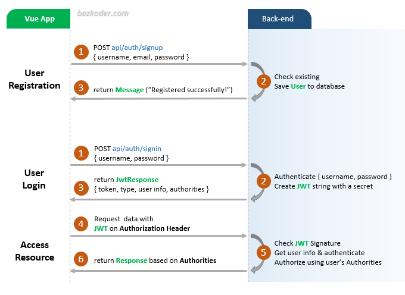
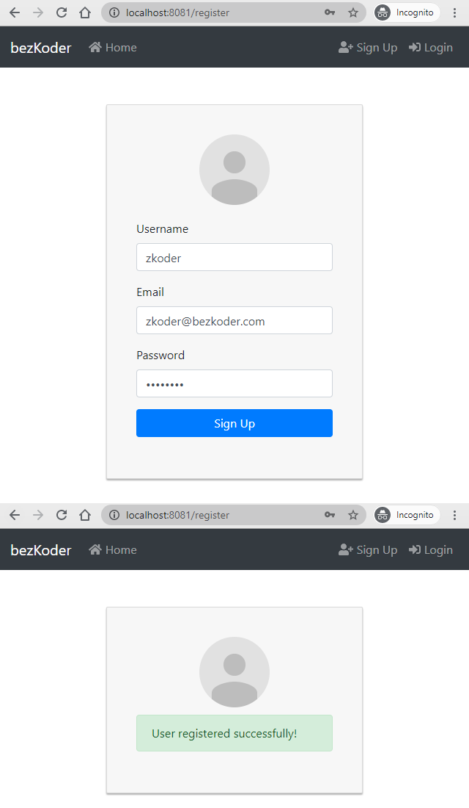
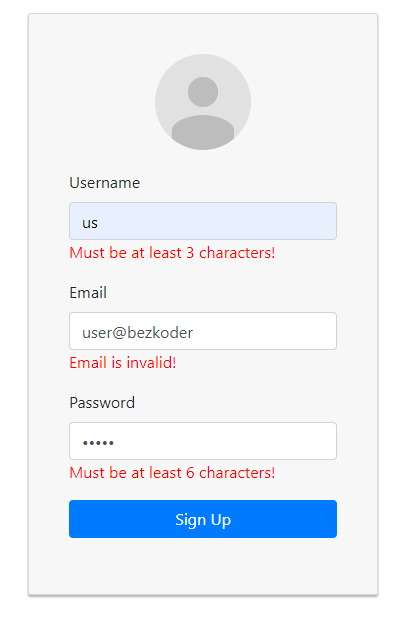
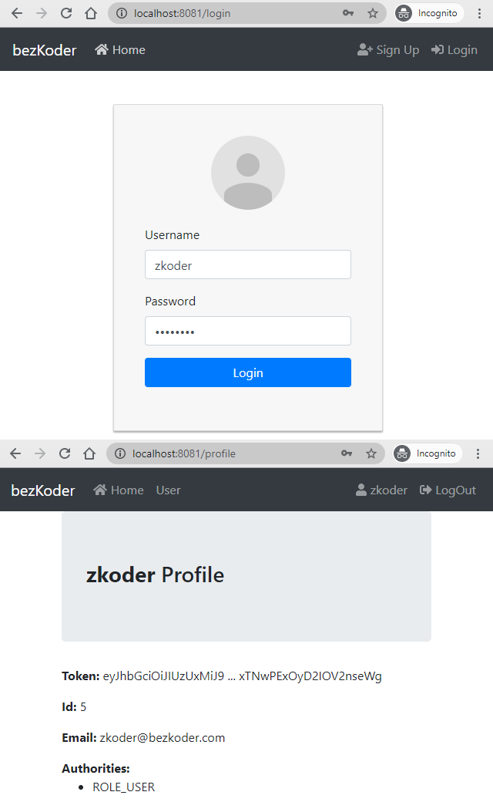

# Vue 3 Authentication with JWT, Vuex, and Vue Router

## Flow for User Registration and User Login

- Signup Page:

- Form Validation could look like this:

- Login Page & Profile Page (for successful Login):

For instruction, please visit:
> [Vue 3 Authentication & Authorization with JWT, Vuex and Vue Router](https://bezkoder.com/vue-3-authentication-jwt/)

